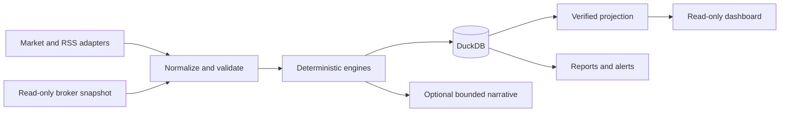

# invest-pipeline

A deterministic, read-only investment research pipeline written in Python. It
covers mutual-fund statistics, valuation-based allocation, stock screens,
EMA10/21 crossover research, news classification, portfolio reconciliation,
accounting, survivor ranking, and a local Streamlit dashboard.

This is educational software, not financial advice. It does not place trades.

## Safety first

The repository contains synthetic examples only. Do not commit broker exports,
portfolio data, statements, databases, logs, screenshots, or credentials.

`INVEST_MODE=demo` is the default. Demo and test modes refuse real Kite network
connections. Live reads require both `INVEST_MODE=live` and an explicit
`INVEST_ALLOW_LIVE_BROKER_READS=READ_ONLY_ACKNOWLEDGED` setting. The client has a
fixed read-route allowlist. There are no order, cancellation, GTT, transfer, or
portfolio-mutation paths.

## Architecture



The model receives prefiltered candidates and writes bounded narrative. Python
owns every metric, threshold, score total, citation link, and state transition.

See [the architecture notes](docs/architecture/overview.md) and
[the methodology specification](SPEC.md).

## Setup

Python 3.12 is required.

```bash
cp .env.example .env
uv sync --all-groups --locked
uv run pytest -q
```

The default configuration is offline-safe. Unit tests mock broker and
external-data clients.

## Checks

```bash
uv run ruff check .
uv run ruff format --check .
uv run pytest -q
python scripts/check_private_markers.py .
python scripts/check_broker_safety.py .
```

## Repository status

This public candidate has fresh Git history. Private source history, production
data, generated reports, and original screenshots were not copied. Release
approval and publication are separate manual steps.

## License

Apache-2.0. See [LICENSE](LICENSE).
