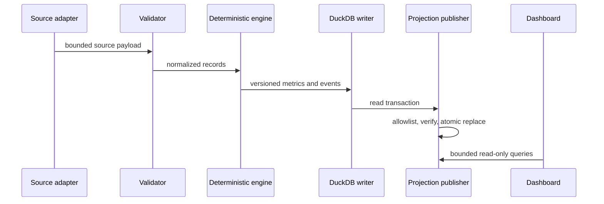
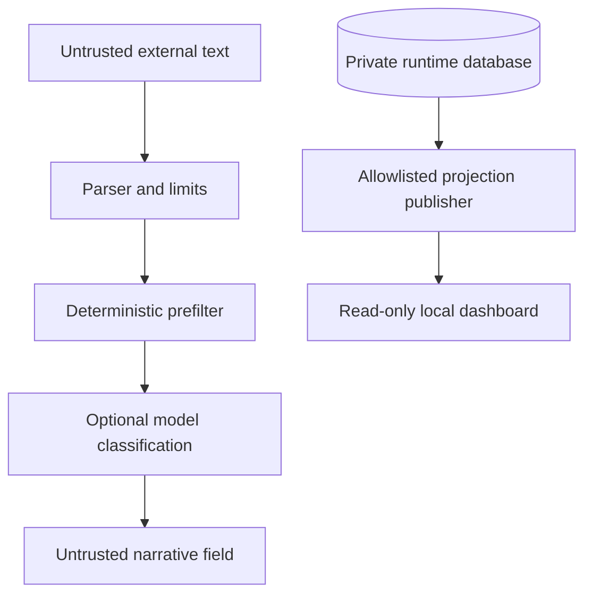

# Architecture

## Data path

Adapters validate response size, schema, dates, and numeric values before data
reaches an engine. Engines have no broker-write capability. Immutable natural
keys and content fingerprints make replays deterministic and expose conflicting
duplicates.

## Trust boundaries

The UI escapes narrative and uses fixed SQL. It never accepts raw SQL. The
projection omits credentials and direct account identifiers.

## Failure isolation

Each adapter returns validated records or an explicit failure. A failed source
does not turn missing data into zero, does not advance a successful watermark,
and does not permit later narrative or alert stages to invent a result.

## Broker access

Kite support is read-only. Tests pass injected openers. A real opener is denied
in demo and test modes and requires a separate live-read acknowledgement.
